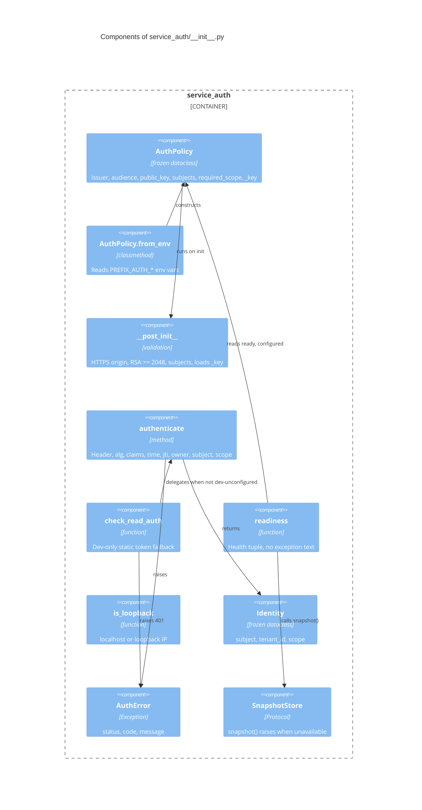

# 07 — C4 Component

component ภายใน `service_auth/__init__.py` (ไฟล์เดียว, 245 บรรทัด)

```mermaid
C4Component
    title Components of service_auth/__init__.py
    Container_Boundary(mod, "service_auth") {
        Component(policy, "AuthPolicy", "frozen dataclass", "issuer, audience, public_key, subjects, required_scope, _key")
        Component(fromenv, "AuthPolicy.from_env", "classmethod", "Reads PREFIX_AUTH_* env vars")
        Component(post, "__post_init__", "validation", "HTTPS origin, RSA >= 2048, subjects, loads _key")
        Component(authn, "authenticate", "method", "Header, alg, claims, time, jti, owner, subject, scope")
        Component(cra, "check_read_auth", "function", "Dev-only static token fallback")
        Component(ready, "readiness", "function", "Health tuple, no exception text")
        Component(loop, "is_loopback", "function", "localhost or loopback IP")
        Component(ident, "Identity", "frozen dataclass", "subject, tenant_id, scope")
        Component(err, "AuthError", "Exception", "status, code, message")
        Component(store, "SnapshotStore", "Protocol", "snapshot() raises when unavailable")
    }
    Rel(fromenv, policy, "constructs")
    Rel(policy, post, "runs on init")
    Rel(cra, authn, "delegates when not dev-unconfigured")
    Rel(authn, ident, "returns")
    Rel(authn, err, "raises")
    Rel(cra, err, "raises 401")
    Rel(ready, store, "calls snapshot()")
    Rel(ready, policy, "reads ready, configured")
```

Sources: `service_auth/__init__.py` (ทุก class/function และ `__all__`)
